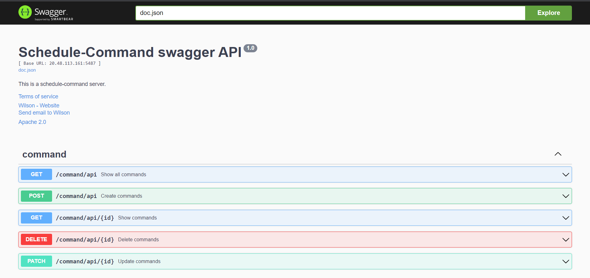

# Schedule_Task_Command 2.6.0

* API Server

  * time template API
  * time API
  * command template API
  * command API
  * header template API
  * task template API
  * task API
  * schedule API
* Time Server
  1. redis subscribe publish topic
  2. 判斷時間是否在規範內
* Command Server
  1. redis subscribe publish topic
  2. 觸發/顯示 即時command
  3. 取消command
  4. 紀錄/顯示 歷史command
* Task Server
  1. redis subscribe publish topic
  2. 觸發/顯示 即時task
  3. 取消task
  4. 紀錄/顯示 歷史task
* Schedule Server
  1. 每秒監控一次schedule
  2. 時間符合則執行相對應的task

## 啟動方式

#### 1. 使用docker-compose

沒有mysql container可以選擇此方式

1. 確定docker 有mysql image

   `docker pull mysql`
2. 修改docker-compose.yaml
   **Windows:** line:51 註解linux命令 取消line:52的註解
   **Linux:** 取消line:52註解 line:51註解windows命令
   line:51:

   ```
   dockerfile: deploy/api/linux/Dockerfile
   ```

   line52:

   ```
   dockerfile: deploy/api/windows/Dockerfile
   ```
3. docker-compose up

   `docker-compose up`

#### 2. 使用DockerFile啟動

有固定的mysql container可選擇此方式

1. ##### Windows系統

   1. 到mysql創建一個新的database "schedule"
      `create database schedule;`
   2. 創建需要的image
      api image:
      `docker build -t schedule:2.6.0 -f deploy/api/windows/Dockerfile .`
      migrate image:

      `docker build -t schedule-migrate:latest -f deploy/migrate/windows/Dockerfile .`
   3. 創建並啟動container

      1. run migrate container
         DB_HOST可指定特定的DB IP

         `docker run --name schedule-migrate --rm -e DB_HOST=host.docker.internal schedule-migrate:latest`
      2. run api container

         `docker run --name schedule -p 5487:5487 -e DB_HOST=host.docker.internal -v ${PWD}/docker/log:/app/log schedule:2.6.0`
2. ##### Linux系統

   1. 到mysql創建一個新的database "schedule"
      `create database schedule;`
   2. 創建需要的image
      api image:
      `docker build -t schedule:2.6.0 -f deploy/api/linux/Dockerfile .`
      migrate image:

      `docker build -t schedule-migrate:latest -f deploy/migrate/linux/Dockerfile .`
   3. 創建並啟動container

      1. run migrate container
         DB_HOST可指定特定的DB IP

         `docker run --name schedule-migrate --rm --network="host" schedule-migrate:latest`
         `docker run --name schedule-migrate --rm -e DB_HOST=192.168.1.11 schedule-migrate:latest`
      2. run api container

         `docker run --name schedule -p 5487:5487 --network="host" -v ${PWD}/docker/log:/app/log schedule:2.6.0`
         `docker run --name schedule -p 5487:5487 -e DB_HOST=192.168.1.11 -e INFLUXDB_HOST=192.168.1.11 -e REDIS_HOST=192.168.1.11 -v ${PWD}/docker/log:/app/log schedule:2.6.0`

# Log File

用docker啟動的程式log file在  docker/log/

## Schedule DB schemas


## Swagger API

* 產生swagger document

  ```
  swag init --parseDependency --parseInternal --parseDepth 1 -d cmd/api
  ````
* swagger document url:

  http://{host}:{post}/swagger/index.html


